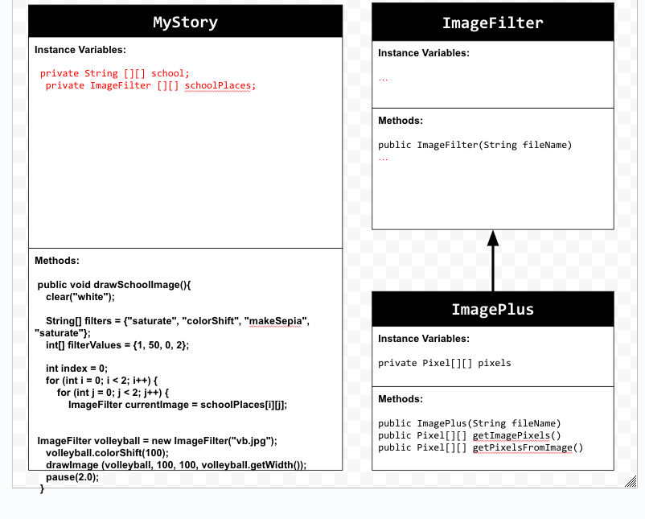

# personal-narrative-project
personal-narrative-project
# Unit 4 - Personal Narrative

## Introduction

Images are often used to portray our personal experiences and interests. We also use image filters and effects to change or enhance the mood of an image. When combined into collages and presentations, these images tell a story about who we are and what is important to us. Your goal is to create a personal narrative using The Theater that consists of images of your personal experiences and/or interests, incorporates data related to these experiences and/or interests that can be organized in a 2D array, and uses image filters and effects to change or enhance the mood of your images.

## Requirements

Use your knowledge of object-oriented programming, two-dimensional (2D) arrays, and algorithms to create your personal narrative collage or animation:

- **Create at least two 2D arrays** – Create at least two 2D arrays to store the data that will make up your visualization.
- **Implement one or more algorithms** – Implement one or more algorithms that use loops and two-way or multi-selection statements with compound Boolean expressions to analyze the data.
- **Use Image Filters** - Include multiple image filters learned from this unit, and additionally create new ones of your own.
- **Use methods in the String class** – Use one or more methods in the String class in your program, such as to determine whether the name of an image file contains specific characters.
- **Create a visualization** – Create an image or animation that conveys the story of the data by illustrating the patterns or relationships in the data.
- **Document your code** – Use comments to explain the purpose of the methods and code segments and note any preconditions and postconditions.

## UML Diagram

Put and image of your UML Diagram here. Upload the image of your UML Diagram to your repository, then use the Markdown syntax to insert your image here. Make sure your image file name is one work, otherwise it might not properly get display on this README.

## Video

Record a short video of your story to display here on your README. You can do this by:

- Screen record your project running on Code.org.
- Upload that recording to YouTube.
- Take a thumbnail for your image.
- Upload the thumbnail image to your repo.
- Use the following markdown

[![Thumbnail for my projet]](https://youtube.com/shorts/HGi-7bgC8Gc?feature=share)

## Story Description

Write a description of the story that your animation showcases. Give addional context for your story here in the case your animation is more abstract and only has images and little text. Lastly, include what data in your project is represented in 2D arrays and how those directly relate to the story your animation showcase.

My project is about where I have travelled and what I have done during my highschool season of volleyball. The images shown show Vegas, the New Orelans Hotel, an arcade, and a volleyball tournament. The images pop up after the text shows the name of what will be seen on the screen. The 2D arrays consist of the names of the places and things we did and the next 2D array shows the images of what the text is saying. 
## Image Filter Analysis

Two filters in my code are saturate and colorShift. The saturate method fixes the pixels by making the image darker and the higher the number you place it, the darker it becomes. The colorShift method fixes the pixels by making the image lighter with the higher number you place. 